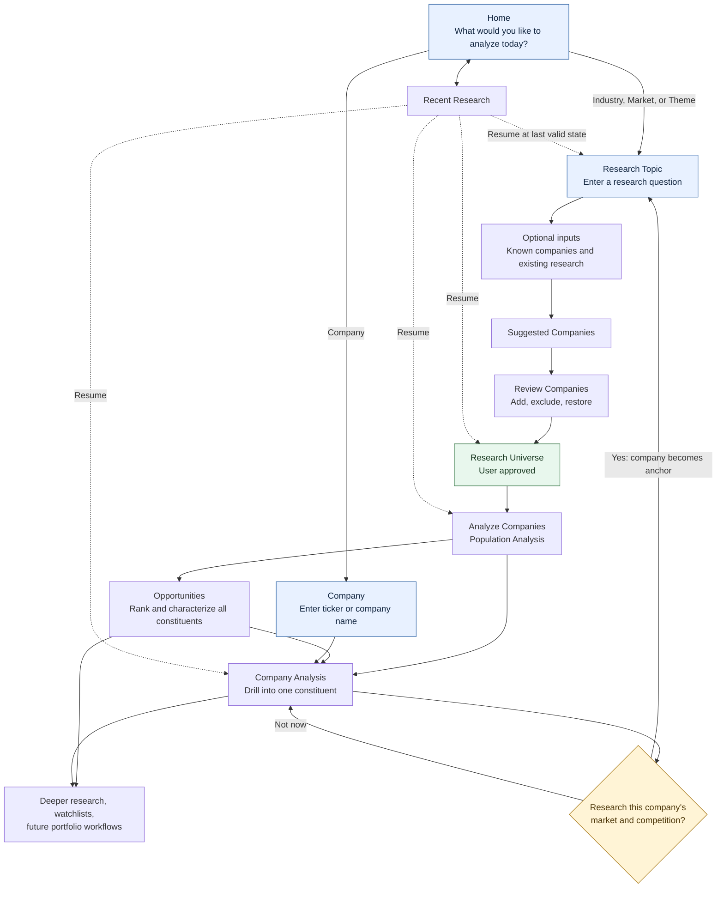
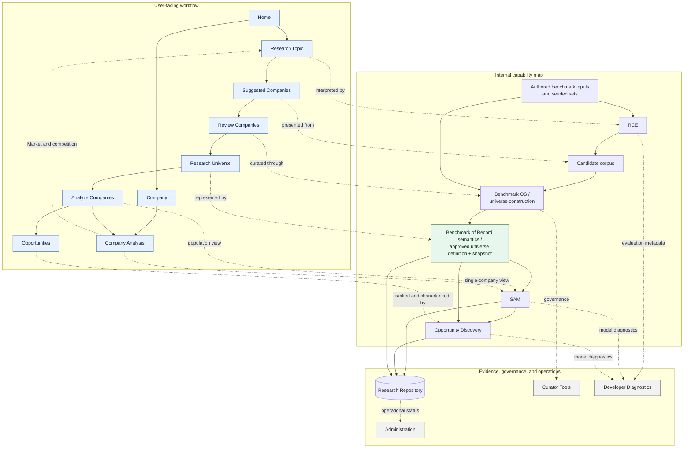
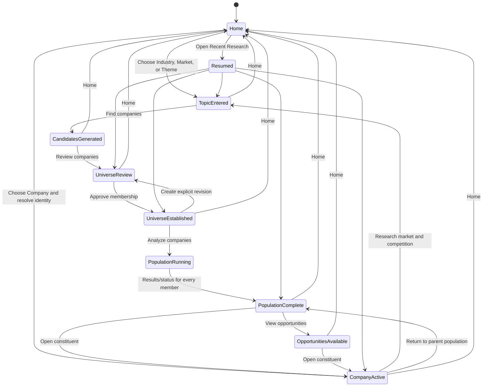
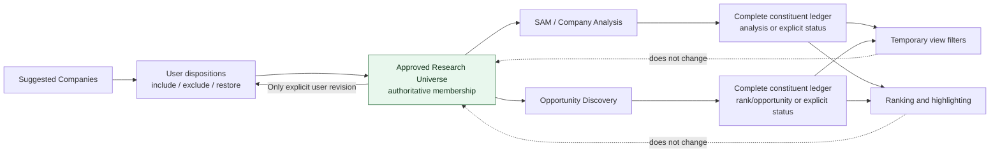

# Product Information Architecture v1.0 — Diagrams

**Status:** Companion to `Product_Information_Architecture_v1.0.md`
**Scope:** Conceptual diagrams; documentation only

## 1. User-facing workflow

The Company-to-market branch enters the same Research Topic and universe-construction workflow. It does not create a second candidate, company-analysis, or opportunity engine.

## 2. User workflow mapped to internal architecture

## 3. Progressive navigation by state

Navigation reveals only states that exist or actions that are currently valid. Home and Recent Research remain consistently reachable.

## 4. Research Universe membership contract

Membership is distinct from ranking, temporary display filtering, recommendation, and non-membership dispositions such as watch or dismiss. A revised membership set requires an explicit user edit and approval.
