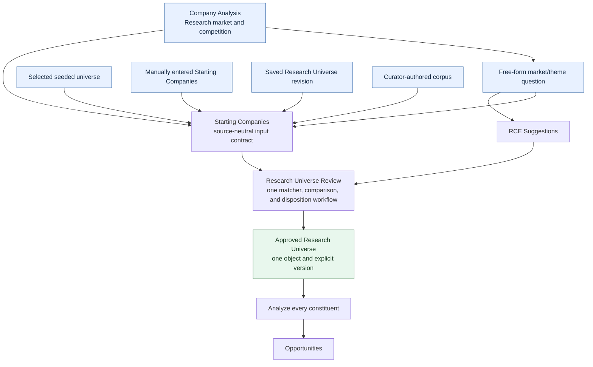
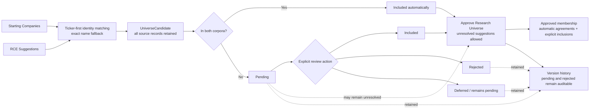
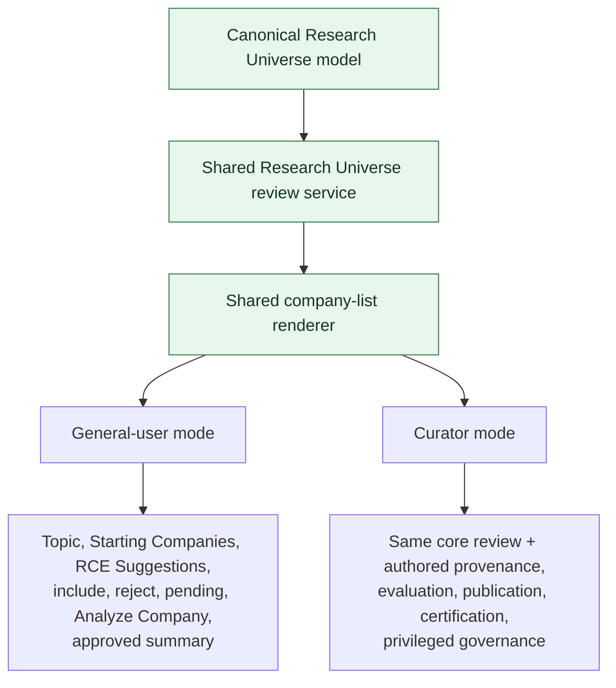
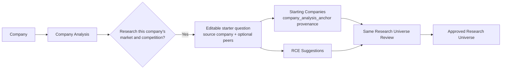
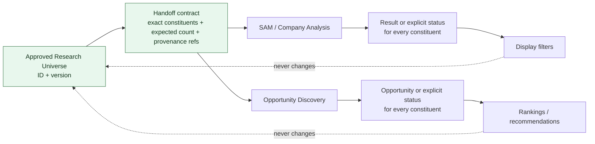

# Product Information Architecture v1.1 — Diagrams

**Status:** Companion to `Product_Information_Architecture_v1.1.md`

## 1. All inputs converge on one Research Universe

Source origin is provenance. It does not select a different review engine or Research Universe type.

## 2. Canonical candidate and membership lifecycle

## 3. Role overlays on one review capability

Curator is a permission context, not a separate universe or CRUD implementation.

## 4. Company-to-market workflow

No parallel peer-analysis or universe-review engine is created.

## 5. Downstream non-filtering contract

Approving a Research Universe creates the contract only. It does not automatically launch SAM or Opportunity Discovery.
