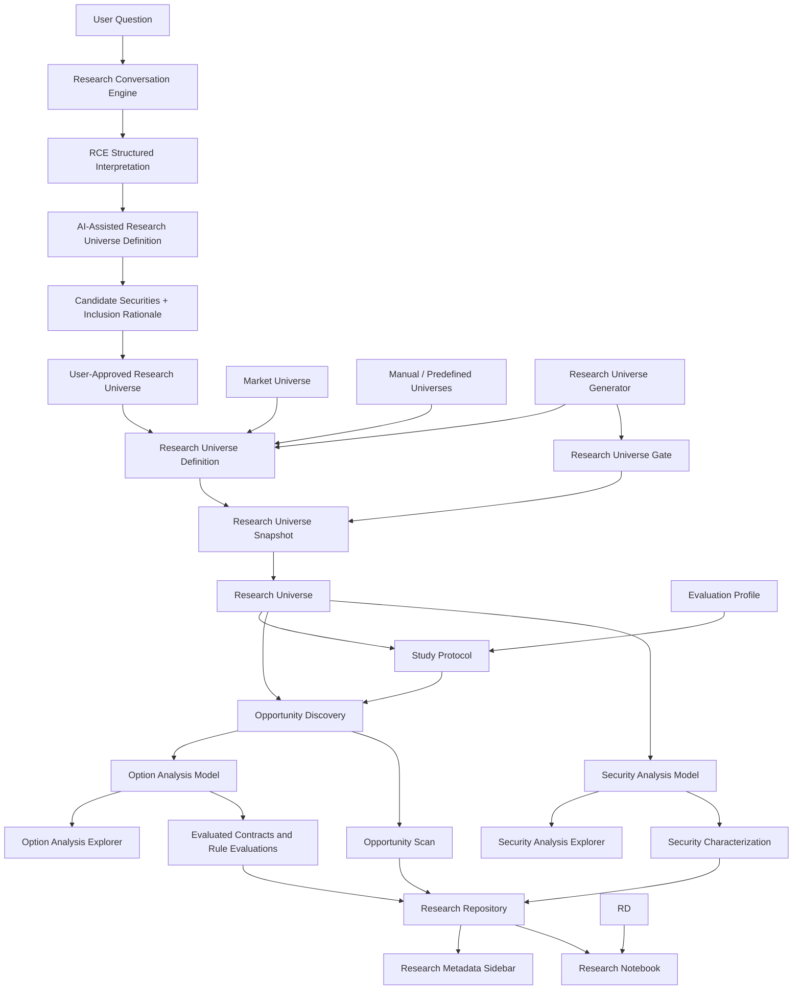
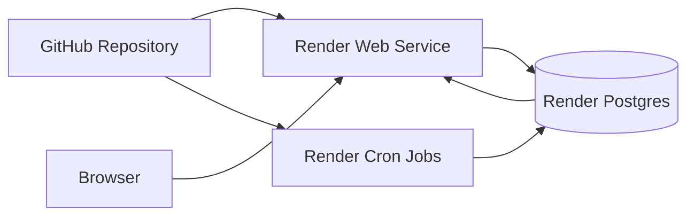

# Quantitative Research Platform Architecture

## Purpose

This document describes the current architecture and research direction of the Kip Options quantitative research platform.

The platform has evolved from a local stock/options screener into a cloud-capable quantitative research system for repeated observation, security analysis, opportunity analysis, and evidence accumulation. It is not a trading system, recommendation engine, broker integration, or order-routing service.

The product-level vision and experience architecture that sits above this technical roadmap is documented in `docs/product/Product_Vision_and_Experience_Architecture.md`.

The formal product design for Research Question Taxonomy and Research Conversation Engine behavior is documented in `docs/product/Research_Question_Taxonomy_and_Conversation_Design.md`.

---

## Architectural Frame

The core architecture separates five responsibilities:

- Research Conversation: translate user intent into reviewable structured research artifacts.
- Research Guidance: persist contextual help around the active Research Session after the initial conversation ends.
- Universe Definition: select, generate, version, and snapshot defined study populations.
- Security Research: characterize underlying securities.
- Opportunity Research: discover and evaluate option opportunities over a Research Universe.
- Metadata: persist descriptive context about repositories, protocols, scans, and execution state.
- Research: accumulate evidence through repeatable protocols and notebook interpretation.

This separation keeps model behavior interpretable. Universe Definition can run without making research conclusions. Evaluation can produce contract-quality evidence without claiming predictive power. Characterization can describe market state without changing rankings. Research can reason over accumulated evidence without mutating production behavior.

---

## Core Domain Concepts

### Product Research Journey

The platform is evolving from a traditional screener into a question-driven research platform. The intended product journey is:

Question -> Research Conversation -> Research Guidance -> Research Mission -> Research Universe -> Security Analysis -> Opportunity Discovery -> Findings -> Research Refinement

Conversation starts the process by clarifying intent and preparing research artifacts. Evidence completes it through Security Analysis, Opportunity Discovery, Findings, and saved Research Session state.

The platform should remember research rather than conversations. Durable records should emphasize the Original Question, Research Mission, Research Universe, Findings, Refinements, Decisions, and Saved Notes.

### Market Universe

The Market Universe is the broad set of securities that could theoretically be observed by the platform. It is larger than any one study and may include equities, ETFs, sectors, or future market populations not yet active in a protocol.

The Market Universe is a conceptual boundary, not the current execution input. It answers: what could be studied?

### Research Conversation Engine

The Research Conversation Engine (RCE) is the upstream workflow that translates a user's plain-language research question into structured research artifacts for user review.

RCE starts with a Research Mission, creates a structured interpretation, proposes Candidate Securities with Inclusion Rationale, and helps the user review, edit, name, and approve a Research Universe Definition before analysis begins.

RCE uses the Research Question Taxonomy (RQT) as its upstream classification layer. RQT classifies the user's research intent into domains such as Discover, Evaluate, Opportunity Research, Compare, Learn, Validate, Monitor, and Build, then identifies applicable lenses such as Technical, Fundamental, Options, Income, Risk, Valuation, Competitive Position, Event-Driven, Macro Exposure, and Theme / Narrative.

RCE exists only to understand intent, clarify when necessary, define a Research Mission, and propose a Research Universe. It does not score securities, evaluate options, recommend trades, replace analytical models, become a chatbot, answer arbitrary questions, create Study Protocol results, or write model conclusions. Its responsibility is intent translation and artifact preparation.

### Research Guidance

Research Guidance is persistent contextual support attached to the active Research Session after Research Conversation has produced reviewable artifacts.

Research Conversation is brief. It clarifies the question and gets the user to a Research Mission and proposed universe. Research Guidance continues through the session by explaining the current mission, universe, analysis state, findings, missing evidence, and possible refinements.

Research Guidance does not create recommendations or analytical conclusions. It helps the user understand the research process while SAM, OD, OAM, OAE, Study Protocols, and the Research Repository continue to own evidence generation and persistence.

### Research Session

A Research Session is the first-class durable record of a user's research process.

It includes:

- Original Question.
- Research Mission.
- Research Universe.
- Findings.
- Refinements.
- Decisions.
- Saved Notes.

The Research Session is the product memory boundary. It preserves research state, evidence references, and user decisions rather than preserving conversation as the primary artifact.

### Research Refinement

Research Refinement is a structured modification to existing research. It may change the mission, universe membership, lenses, downstream path, findings, notes, or decisions.

Refinement should be recorded as a change to the Research Session, not treated as an endless continuation of an AI chat.

### Candidate Security

A Candidate Security is a security proposed by RCE for possible inclusion in an AI-Assisted Research Universe Definition.

Candidate status is provisional. It means the security may be relevant to the user's Research Mission and should be reviewed by the user before approval. It does not imply quality, attractiveness, option suitability, or trade recommendation.

### Inclusion Rationale

Inclusion Rationale is the short explanation attached to a Candidate Security that describes why it may belong in the proposed universe.

The rationale explains research scope. It is not a score, ranking, or recommendation.

### User-Approved Research Universe

A User-Approved Research Universe is an AI-assisted or manually created Research Universe Definition after the user has reviewed, edited, named, and saved it.

Downstream analysis should operate only after user approval and snapshot creation.

### Research Universe

A Research Universe is the central workflow object of the research platform: a named, explicit study population selected from the Market Universe for a research purpose. It replaces the older "watchlist", "Corpus", and "Reference Universe" terminology as the first-class population concept.

A Research Universe answers:

- Which securities are in scope for this study or scan?
- Why were these securities selected?
- Which population should results be interpreted against?

A Research Universe may be static or dynamic. Static universes are predefined from manual or curated membership. Dynamic universes are produced by a generator from documented criteria. Downstream workflows should not care how the universe was created; they should consume the resulting Research Universe Definition or Research Universe Snapshot.

### Research Universe Definition

A Research Universe Definition is the reusable specification for a Research Universe. It records the name, purpose, selection method, criteria, source data, ownership notes, and expected refresh behavior.

Manual and predefined CSV-backed universes are valid Research Universe Definitions. Generated universes are also valid Research Universe Definitions when their generator and criteria are documented.

The formal design target for this area is `docs/architecture/Research_Universe_Design_Specification.md`.

### Static Research Universe

A Static Research Universe has explicit membership supplied by a manual list, curated file, or predefined dataset. Current CSV-backed universe files are implementation artifacts for Static Research Universe Definitions.

### Dynamic Research Universe

A Dynamic Research Universe is produced or refreshed from selection criteria, source data, and a repeatable generation process. It may change membership across refreshes, but each run should produce a snapshot for reproducibility.

### Research Universe Generator

A Research Universe Generator creates or refreshes Research Universe Definitions and snapshots from manual lists, technical criteria, fundamental criteria, news, sentiment, or other future population-construction inputs.

It does not evaluate option contracts and does not change OAM thresholds. Its role is population construction, not opportunity scoring. "Security Discovery" is an older or broader name for this future population-construction responsibility.

The generator may use SAM-derived values as inputs when a Research Universe Definition explicitly declares those gates. SAM remains the source of security-level observations; it does not own generator policy or membership decisions.

### Research Universe Gate

A Research Universe Gate is a single inclusion or exclusion rule used by a Research Universe Generator. Examples include RSI between 55 and 70, MACD state bullish, price above SMA50, average volume above a threshold, or sector inclusion and exclusion.

Gates are population-construction rules. They do not evaluate option contracts and do not modify OD, OAM, OAE, SAM, SAE, Evaluation Profiles, or Study Protocol execution.

### Research Universe Snapshot

A Research Universe Snapshot is the point-in-time membership of a Research Universe used by a scan, Study Protocol observation, or research run. It preserves reproducibility by recording exactly which securities were in scope for that observation, regardless of whether membership came from a static list or a dynamic generator.

Downstream workflows should consume snapshots, not definitions directly. A scan should be attributable to both a `universe_definition_id` and a `universe_snapshot_id` once explicit persistence is implemented.

### Opportunity Discovery

Opportunity Discovery executes scans over a Research Universe. It retrieves market data, evaluates option chains, applies option analysis, and selects visible passing or near-miss candidates for review.

Opportunity Discovery currently operates against manually defined CSV-backed Research Universes. It owns orchestration and candidate presentation. It does not own OAM rule definitions, SAM characterization, research conclusions, or future outcome claims.

### Option Analysis Model

The Option Analysis Model (OAM), historically called the Contract Quality Model (CQM), evaluates option contracts using option-level rules such as delta fit, spread, open interest, volume, and score components.

OAM answers: is this option contract structurally acceptable under the active rules?

It remains independent from security-level analysis and does not consume SAM values for filtering, scoring, ranking, or threshold changes.

### Security Analysis Model

The Security Analysis Model (SAM), historically called the Technical Analysis Model (TAM), records underlying-security technical context at scan time. Current indicators include price, moving-average relationships, RSI, MACD, realized volatility, and derived state labels when data supports them.

SAM answers: what technical condition was observable for the underlying security at the time of the scan?

SAM is the current Security Research model. It does not modify Opportunity Discovery, OAM scoring, OAE diagnostics, Evaluation Profile behavior, or Study Protocol execution.

The Security Setup Score shown in the Security Analysis Explorer (SAE), historically the Technical Analysis Explorer (TAE), is Experimental / Observational. It summarizes SAM observations for visual review only. It does not define Research Universe gates and does not influence option scoring, Opportunity Discovery, OAM, OAE, rankings, filters, thresholds, or Evaluation Profile logic.

The current SAM field definitions, calculations, decision trees, limitations, and future evolution notes are documented in `docs/research/Technical_Analysis_Model_Specification.md`, whose file name preserves the historical TAM terminology.

### Security Analysis Explorer

The Security Analysis Explorer (SAE), historically called the Technical Analysis Explorer (TAE), is the analytical workspace for inspecting SAM observations, summary distributions, technical states, visual setup scores, and QA tables.

SAE is observational. It does not change Opportunity Discovery, OAM scoring, Research Universe membership, Study Protocol execution, or repository behavior.

### Option Analysis Explorer

The Option Analysis Explorer (OAE), historically called Quality Engine Diagnostics (QED), is the analytical workspace for inspecting OAM score distributions, rule evaluations, pass and near-miss behavior, diagnostics, and option-analysis evidence.

OAE explains option-analysis behavior after OAM evaluation. It does not define Research Universe membership, SAM calculations, OAM thresholds, rankings, or Study Protocol rules.

### Research Repository

The Research Repository persists completed observations and linked evidence. Local development uses SQLite. Cloud deployment uses Postgres through the repository backend configuration.

The repository stores empirical evidence, not interpretations. It supports archived Opportunity Scans, evaluated contracts, rule evaluations, security characterization, technical characterization, Study Protocol context, and protocol progress.

### Study Protocol

A Study Protocol defines repeatable observational research: purpose, Research Universe, Evaluation Profile, option type, DTE range, run mode expectations, and schedule labels.

Study Protocols separate planned evidence from exploratory scans. Scheduled observations count toward protocol progress only when archived with the appropriate run mode and scheduled time label.

---

## Logical Domain Model

Key relationship rules:

- A Market Universe contains securities that could be studied.
- A Research Universe is the central study population selected from the Market Universe.
- A Research Universe Definition documents how the universe is specified, whether manually, predefined, or generated.
- A Static Research Universe has explicit curated membership.
- A Dynamic Research Universe is generated from criteria and source data.
- A Research Universe Generator creates or refreshes Research Universe Definitions and snapshots; current Research Universes are manually defined CSV files.
- A Research Universe Gate is a single inclusion or exclusion rule applied by a generator.
- A Research Universe Snapshot preserves the exact point-in-time membership used by an observation.
- A Study Protocol binds research purpose, population, schedule, and execution context.
- Opportunity Discovery observes the Research Universe at a point in time.
- OAM evaluates option contracts.
- SAM characterizes underlying securities.
- The Research Repository stores evidence.
- The Research Notebook records observations, hypotheses, rationale, and conclusions.

---

## Research Workflow

The product-level research workflow is:

Question -> Research Conversation -> Research Guidance -> Research Mission -> Research Universe -> Security Analysis -> Opportunity Discovery -> Findings -> Research Refinement

The canonical technical workflow is:

User Question -> RCE Structured Interpretation -> Candidate Universe Proposal -> User Review/Edit/Name -> Research Universe Definition -> Research Universe Snapshot -> SAM/SAE -> OD/OAM/OAE -> Research Repository

The older technical shorthand remains valid after the user-approved universe exists:

Market Universe -> Research Universe Definition -> Research Universe Snapshot -> Security Analysis Model / Security Analysis Explorer -> Opportunity Discovery -> Option Analysis Model / Option Analysis Explorer -> Research Repository / Study Protocols

In practice, the user starts with a Research Mission or selects an existing Research Universe. When RCE is used, it creates a structured interpretation and proposes candidate membership. The user reviews, edits, names, and saves the definition before the Research Universe Snapshot is created. That universe may be static, such as a manual or predefined CSV-backed list, AI-assisted through RCE, or dynamically generated from documented criteria. Once selected and approved, the Research Universe Snapshot preserves the exact securities used for the observation so later analysis remains reproducible.

SAM characterizes the securities in the selected universe, and SAE provides analytical exploration of those security-level observations. Opportunity Discovery then finds visible option opportunities from that same universe. OAM evaluates the option contracts, and OAE provides analytical exploration of model behavior, scores, rules, pass outcomes, and near misses. The Research Repository stores the resulting evidence, while Study Protocols make repeated observations comparable and repeatable.

Downstream workflows should not depend on whether a Research Universe came from a manual list, a predefined file, or a generator. They should operate against the selected Research Universe and its snapshot.

RCE is upstream of this downstream workflow. It may propose a universe, but it does not change SAM calculations, SAE displays, Opportunity Discovery, OAM scoring, OAE diagnostics, Evaluation Profiles, Study Protocols, cloud jobs, repository schema, or stored evidence semantics.

---

## Cloud Deployment Architecture

Deployment responsibilities:

- GitHub stores application, runner, and documentation source.
- Render Web Service hosts the Streamlit research dashboard.
- Render Cron Jobs execute scheduled Study Protocol observations.
- Render Postgres is the cloud Research Repository.
- Browser sessions inspect dashboard views backed by the cloud repository.

Cloud execution preserves the same domain boundaries as local execution. Cron jobs create observations; they do not reinterpret research evidence. The web service presents and inspects evidence; it does not replace scheduled execution.

---

## Current Architecture State

### Complete or Substantially Complete

- Evaluation Profiles.
- CSV-backed Static Research Universe Definitions, historically Reference Universes.
- Opportunity Discovery.
- Option Analysis Model, historically Contract Quality Model.
- SQLite Research Repository.
- Postgres Research Repository backend for cloud use.
- Study Protocols.
- Export instrumentation.
- Scheduled Observation execution.
- Research metadata sidebar protocol progress.
- Security Analysis Model v0.1.
- Security Analysis Explorer v0.1.
- Security Setup Score v0.1 as an Experimental / Observational Explorer display field.
- TAM-001 Daily Technical Characterization protocol and TAM-only runner.
- Research sidebar organization with separate Opportunity Research and Security Research metadata sections.

### Active Evolution

- Cloud-hosted dashboard and scheduled observations on Render.
- Repository abstraction between local SQLite and cloud Postgres.
- Research Universe terminology and first-class documentation.
- Research Universe Definition and Snapshot terminology.
- Research Conversation Engine workflow design for AI-assisted, user-approved Research Universe Definitions.
- Technical characterization as an independent research layer.

### Planned Research Capabilities

- Research Universe Generator implementation.
- Security Characterization expansion.
- Excellent Contract Characterization.
- Rule Characterization expansion.
- Near Miss Characterization.
- Opportunity Concentration and Diversity metrics.
- Security Passports.
- Outcome Tracking.
- Market Context capture.
- Market Regime characterization.
- Versioned research reports.

---

## Roadmap

### Phase 1 - Research Foundation

Status: Complete / Substantially Complete

- Evaluation Profiles.
- Research Universes.
- Opportunity Discovery.
- Option Analysis Model.
- Local Research Repository.
- Study Protocols.
- Export instrumentation.
- Scheduled observation execution.
- Research metadata sidebar protocol progress.

### Phase 2 - Cloud Continuous Observation Infrastructure

Status: Active

- Render Web Service for the dashboard.
- Render Cron Jobs for scheduled research scans.
- Render Postgres as the cloud Research Repository.
- Repository backend configuration.
- Cloud startup checks and environment validation.

### Phase 3 - Research Characterization

Status: Emerging

- Security Analysis Model v0.1 security-level observations.
- Security Analysis Explorer v0.1 QA and observation view.
- Security Setup Score v0.1 visual summary.
- Security Analysis Model Functional Specification v1.0.
- TAM-001 historical observation protocol for daily technical-only scans.
- Security Characterization.
- Excellent Contract Characterization.
- Rule Characterization.
- Near Miss Characterization.
- Opportunity Concentration.
- Security Passports.

SAM remains a research-only layer. It persists underlying-security technical observations but does not filter, score, rank, or otherwise change Option Analysis Model or Opportunity Discovery behavior.

TAM-001 is the historical protocol identifier for SAM-only observations. The `technical_scan.py` runner writes only `technical_characterization` rows and does not run Opportunity Discovery, fetch option chains, evaluate contracts, produce OAM rows, or change OAE, Evaluation Profile, ranking, or threshold behavior.

### Phase RU - Research Universe Architecture

Status: Designed / Planned

The Research Universe implementation should proceed in explicit phases so reproducibility and provider limits are handled before dynamic generation expands the candidate population.

#### Phase RU-1 - Static Definitions and Snapshots

- Formalize static Research Universe Definitions.
- Persist Research Universe Snapshots for existing CSV universes.
- Associate scans with `universe_definition_id` and `universe_snapshot_id`.
- Preserve existing OD, OAM, SAM, scoring, ranking, Study Protocol, cloud job, and UI behavior.

#### Phase RU-2 - Research Universe Management UI

- Add Research Universe management UI.
- Show definitions and snapshots.
- Allow selecting a universe for Opportunity Discovery.
- Keep the UI focused on selection and inspection before adding generation behavior.

#### Phase RU-3 - Dynamic Generator With Existing SAM Fields

- Add a Research Universe Generator using existing SAM fields.
- Start with a bounded candidate list, not the entire market.
- Generate snapshots that OD consumes identically to static snapshots.
- Do not fetch option chains, evaluate option contracts, or alter OAM scoring inside the generator.

#### Phase RU-4 - User-Defined Gates

- Add user-defined Research Universe Gates in the UI.
- Support explicit fields, operators, values, inclusion/exclusion behavior, and validation.
- Preserve snapshot history so future edits to a definition do not rewrite prior research evidence.

Implementation constraints:

- Initial dynamic generation should use bounded candidate Market Universes, such as existing curated CSV files, S&P 500, Nasdaq 100, or a manually curated optionable list.
- Candidate universe data sources may include CSV files, index constituent sources, provider quote/history data, sector data, average volume, and optionable-status references.
- Tradier or other provider use introduces rate-limit, latency, coverage, symbol-format, and data freshness risks. Universe generation should avoid option-chain retrieval and should record provider/data freshness metadata when practical.

### Phase RCE - Research Conversation Engine

Status: Designed / Planned

The Research Conversation Engine should be implemented as a user-reviewed workflow before any downstream research execution changes.

RCE depends on the Research Question Taxonomy design specified in `docs/product/Research_Question_Taxonomy_and_Conversation_Design.md`. RQT produces a Research Intent Profile that RCE turns into a reviewable Research Mission, Research Strategy, and proposed Research Universe Definition.

RCE should remain intentionally narrow. It exists only to understand intent, clarify when necessary, define a Research Mission, and propose a Research Universe. It should not become the platform's analytical model, recommendation layer, or general-purpose chatbot.

#### Phase RCE-1 - Workflow and Artifact Design

- Define RCE, Research Mission, AI-Assisted Research Universe Definition, Candidate Security, Inclusion Rationale, User-Approved Research Universe, and Research Universe Snapshot.
- Document the user-reviewed workflow from plain-language question to approved Research Universe Definition.
- Define RQT intent domains, research lenses, Research Intent Profile fields, confidence handling, persona-aware conversation, representative scenarios, and future prompt template needs.
- Keep the sprint documentation-only.

#### Phase RCE-2 - Research Workspace UX Prototype

- Add a Research Workspace landing page.
- Add mission input prompt.
- Show RCE structured interpretation.
- Distinguish brief Research Conversation from persistent Research Guidance.
- Create the Research Session concept in the experience model with Original Question, Research Mission, Research Universe, Findings, Refinements, Decisions, and Saved Notes.
- Show proposed universe preview with Candidate Securities and Inclusion Rationale.
- Allow edit, name, save, and proceed choices.
- Preserve existing OD, OAM, SAM, SAE, OAE, Evaluation Profile, Study Protocol, cloud job, and repository behavior.

#### Phase RCE-3 - Approved Universe Persistence

- Persist user-approved Research Universe Definitions and Research Universe Snapshots.
- Record approval metadata and inclusion rationale where appropriate.
- Do not change scoring, option evaluation, SAM calculations, or Study Protocol semantics.

#### Phase RCE-4 - Guided Research Handoff

- Let the user proceed from an approved snapshot to Security Research or Opportunity Research.
- Keep Security Research and Opportunity Research visibly distinct.
- Store resulting evidence in the Research Repository with universe definition and snapshot context.

### Phase 4 - Longitudinal Research

Status: Planned

- Trend Analysis.
- Security Behavior Classification.
- Evaluation Profile Health.
- Rule Stability.
- Opportunity Diversity Index.
- Opportunity Concentration Index.
- Model Drift Detection.

### Phase 5 - Outcome Research

Status: Planned

- Forward Outcome Tracking.
- Underlying Security Tracking.
- Contract Tracking.
- Market Context Capture.
- Outcome Attribution.

### Phase 6 - Scientific Evaluation

Status: Planned

- Hypothesis Testing.
- Evaluation Profile Comparison.
- Option Analysis Model Comparison.
- Versioned Research Reports.
- Model Performance Characterization.

---

## Guiding Statement

The objective of the platform is not to predict markets. The objective is to characterize, measure, and improve analytical models through disciplined observation and accumulated evidence.
