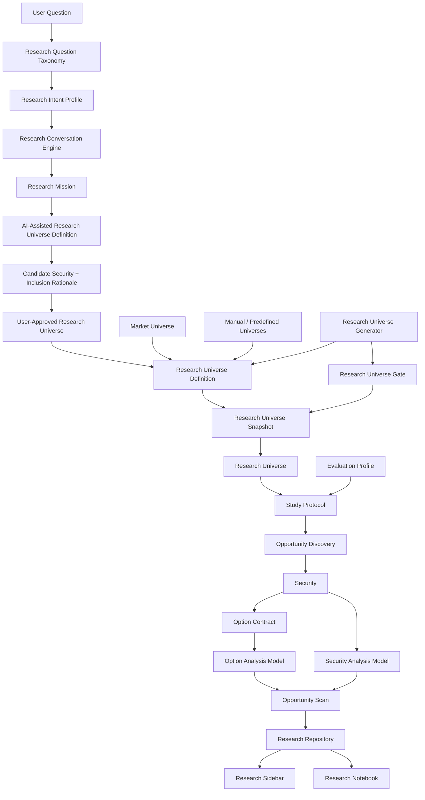

# Domain Model and Glossary

## Purpose

This glossary defines the current language of the Kip Options quantitative research platform.

The platform began as a stock/options screener, but the current architecture is a cloud-capable quantitative research system. The preferred vocabulary now centers on Market Universes, Research Universes, Research Universe Definitions and Snapshots, Opportunity Discovery, independent models, Study Protocols, and a persistent Research Repository.

---

## Executive Summary

| Entity | Definition | Primary Question | Status |
| --- | --- | --- | --- |
| Research Question Taxonomy (RQT) | The product taxonomy that classifies a user's natural-language research question by intent domain, lens, scope, confidence, and clarification need. | What kind of research is the user asking for? | Designed / Planned |
| Research Intent Profile | The structured output of RQT classification and the handoff object into RCE. | How should the user's question be represented before conversation artifacts are proposed? | Designed / Planned |
| Research Conversation Engine (RCE) | The guided workflow that translates a user's research question into structured, user-reviewed research artifacts. | How does user intent become a research artifact? | Designed / Planned |
| Research Guidance | Persistent contextual support attached to a Research Session after the brief Research Conversation has clarified intent. | What should the user understand about the current research state? | Product concept |
| Research Session | The durable product record of a user's research process, including original question, mission, universe, findings, refinements, decisions, and saved notes. | What research should the platform remember? | Product concept |
| Research Refinement | A structured modification to existing research rather than a continuation of a generic AI chat. | What changed in this research and why? | Product concept |
| Research Mission | The user's top-level investment question, thesis, or exploratory intent. | What are we researching? | Product concept |
| Research Strategy | The user-understandable plan for investigating a Research Mission. | How will this mission be researched? | Product concept |
| AI-Assisted Research Universe Definition | A proposed Research Universe Definition produced from a Research Mission and requiring user review before use. | What universe is being proposed? | Designed / Planned |
| Candidate Security | A security proposed by RCE for possible inclusion in a Research Universe. | Why might this security be in scope? | Designed / Planned |
| Inclusion Rationale | The explanation for why a Candidate Security may belong in the proposed universe. | Why is this candidate included? | Designed / Planned |
| User-Approved Research Universe | A Research Universe Definition after the user has reviewed, edited, named, and saved it. | What universe did the user approve? | Designed / Planned |
| Market Universe | The broad population of securities that could theoretically be studied. | What could be studied? | Conceptual |
| Research Universe | The central workflow object: a named, explicit study population selected from the Market Universe for a research purpose. | Which securities are in scope for this study? | Current |
| Research Universe Definition | The reusable specification for a Research Universe, including purpose, selection method, criteria, source data, and refresh behavior. | How is this universe defined? | Current / Emerging |
| Static Research Universe | A Research Universe with explicit membership supplied by a manual list, curated file, or predefined dataset. | Which fixed securities are in scope? | Current |
| Dynamic Research Universe | A Research Universe produced or refreshed from criteria, source data, and a repeatable generation process. | Which generated securities are in scope now? | Planned |
| Research Universe Generator | Population-construction functionality that creates or refreshes Research Universe Definitions and Snapshots from criteria and source data. | How was this study population selected? | Future |
| Research Universe Gate | A single inclusion or exclusion rule used by a Research Universe Generator. | Why is this security included or excluded? | Planned |
| Research Universe Snapshot | The point-in-time membership of a Research Universe used by a scan, protocol observation, or research run. | Which exact securities were observed? | Emerging |
| Evaluation Profile | A versioned analytical configuration for model versions, defaults, and output preferences. | Which analytical configuration is active? | Current |
| Study Protocol | A repeatable observational study definition with purpose, population, configuration, run mode, and schedule context. | Why and how is this observation repeated? | Current |
| Opportunity Discovery | The scan workflow that observes a Research Universe and identifies visible passing or near-miss option candidates. | What opportunities are visible now? | Current |
| Security | A tradable underlying instrument such as an equity or ETF. | What underlying asset is being studied? | Current |
| Option Contract | A listed derivative contract for a Security. | What specific contract is being evaluated? | Current |
| Security Research | The domain for characterizing and analyzing underlying securities. | What is known about the underlying security? | Current |
| Security Analysis Model (SAM) | The independent security-level model that records technical condition at scan time. | What technical condition was observable for the underlying security? | v0.1 |
| Security Analysis Explorer (SAE) | The main-workspace explorer for SAM summaries, distributions, RSI, momentum, volatility, and QA tables. | What does security analysis show? | Current |
| Opportunity Research | The domain for discovering and evaluating option opportunities over a Research Universe. | What option opportunities are visible and how did the option model behave? | Current |
| Option Analysis Model (OAM) | The option-level model that evaluates option quality using explicit rules and score components. | Is this option contract structurally acceptable? | Current |
| Option Analysis Explorer (OAE) | The main-workspace explorer for score distributions, rule evaluations, pass/near-miss analysis, diagnostics, and option analytics. | How did option analysis behave? | Current |
| Security Setup Score | An Experimental / Observational score summarizing SAM display states from 0 to 100. | How constructive does the current security setup appear for visual review? | Display-only |
| Opportunity Scan | One completed Opportunity Discovery run archived as point-in-time evidence. | What was observed at one time? | Current |
| Research Repository | The persistent archive for scans, evaluated contracts, rules, characterizations, and protocol metadata. | Where is empirical evidence stored? | Current |
| Research Sidebar | The sidebar surface for metadata about Security Research and Opportunity Research. | What operational metadata is visible? | Current |
| Research Notebook | The permanent research journal for observations, hypotheses, rationale, and conclusions. | What has been learned or questioned? | Current |

---

## Core Domain Entities

### Research Question Taxonomy (RQT)

Definition: The product taxonomy that classifies a user's natural-language research question by research intent domain, research lenses, mentioned entities, scope, sophistication estimate, confidence, and clarification need.

Purpose: Identify what kind of research the user is asking for before the platform proposes a Research Mission, Research Strategy, or Research Universe Definition.

Owns: Intent-domain classification, research-lens classification, interpretation confidence, and the structured Research Intent Profile.

Does NOT Own: Security scoring, option evaluation, trade recommendations, Opportunity Discovery behavior, SAM calculations, OAM scoring, Study Protocol behavior, repository schema, cloud jobs, or research conclusions.

Relationships: Produces a Research Intent Profile consumed by the Research Conversation Engine.

Status: Designed / Planned. Defined in `docs/product/Research_Question_Taxonomy_and_Conversation_Design.md`.

### Research Intent Profile

Definition: The structured output of RQT classification.

Purpose: Preserve the interpreted user intent in a form that RCE can use to drive clarification, mission creation, strategy creation, universe proposal, and downstream path selection.

Owns: Original question, primary domain, primary intent, secondary intents, research lenses, mentioned companies, themes, industries, time horizon, asset focus, estimated user sophistication, confidence, and clarification need.

Does NOT Own: Candidate-security final approval, model output, scan execution, option analysis, security analysis, or investment conclusions.

Relationships: Created by RQT and consumed by RCE before Research Mission and Research Strategy artifacts are proposed.

Status: Designed / Planned. Defined in `docs/product/Research_Question_Taxonomy_and_Conversation_Design.md`.

### Research Conversation Engine (RCE)

Definition: The guided workflow that translates a user's plain-language research question into structured research artifacts the user can review before downstream analysis begins.

Purpose: Help the user move from intent to a reviewable Research Universe Definition without bypassing user approval or model boundaries. RCE exists only to understand intent, clarify when necessary, define a Research Mission, and propose a Research Universe.

Owns: Structured mission interpretation, candidate universe proposal, Candidate Securities, Inclusion Rationale, review/edit/name/save workflow, and handoff to snapshot creation.

Does NOT Own: Security scoring, option evaluation, trade recommendations, analytical model behavior, general chatbot behavior, arbitrary question answering, OAM scoring, SAM calculations, Opportunity Discovery behavior, Evaluation Profile behavior, Study Protocol execution, repository schema, cloud jobs, or research conclusions.

Relationships: Starts from a Research Mission and may produce an AI-Assisted Research Universe Definition that becomes a User-Approved Research Universe after user review.

Status: Designed / Planned.

### Research Guidance

Definition: Persistent contextual support attached to an active Research Session after the initial Research Conversation has clarified intent and proposed reviewable artifacts.

Purpose: Help the user understand the current mission, universe, analysis state, findings, missing evidence, saved notes, decisions, and possible refinements without turning the product into an open-ended chatbot.

Owns: Contextual explanation and orientation around the current Research Session.

Does NOT Own: Security scoring, option evaluation, investment recommendations, analytical conclusions, SAM calculations, OAM scoring, Opportunity Discovery behavior, Study Protocol execution, repository evidence, or arbitrary question answering.

Relationships: Follows Research Conversation and remains attached to a Research Session while the user reviews evidence and makes refinements.

Status: Product concept.

### Research Session

Definition: The durable product record of a user's research process.

Purpose: Preserve what the platform should remember about research rather than preserving conversation as the primary artifact.

Owns: Original Question, Research Mission, Research Universe, Findings, Refinements, Decisions, and Saved Notes.

Does NOT Own: Raw evidence storage, model thresholds, scan execution, trade recommendations, or analytical model behavior.

Relationships: Begins with a question and Research Conversation, uses Research Guidance during review, references Research Universe Snapshots and Research Repository evidence, and records Research Refinements over time.

Status: Product concept.

### Research Refinement

Definition: A structured modification to existing research rather than a continuation of an AI chat.

Purpose: Make changes to the mission, universe, lenses, findings, decisions, or notes explicit and attributable to the Research Session.

Owns: The description of what changed, why it changed, and which research state it modifies.

Does NOT Own: Model scoring, recommendation generation, raw evidence mutation, or historical evidence rewriting.

Relationships: Belongs to a Research Session and may produce a revised Research Mission, updated Research Universe Definition, new Research Universe Snapshot, additional Findings, or revised Saved Notes.

Status: Product concept.

### Research Mission

Definition: The user's top-level investment question, thesis, or exploratory intent.

Purpose: Anchor the product experience around what the user is trying to accomplish before exposing data, screens, models, or configuration.

Owns: User intent, research objective, and the plain-language reason for starting a workflow.

Does NOT Own: Universe membership, model behavior, scoring rules, scan execution, repository storage, or research conclusions.

Relationships: A Research Mission may lead to one or more Research Strategies and Research Universes.

Status: Product concept. Defined in `docs/product/Product_Vision_and_Experience_Architecture.md`.

### Research Strategy

Definition: The user-understandable plan for investigating a Research Mission.

Purpose: Translate intent into a structured research workflow without forcing the user directly into a scanner, chart, or preselected universe.

Owns: The conceptual investigation approach, including how a Research Universe may be selected, what analysis may be used, what observations may be collected, and what comparisons may be made.

Does NOT Own: Low-level implementation, scoring parameters, database schema, cloud execution, or model internals.

Relationships: A Research Strategy may use a Research Universe, Security Research, Opportunity Research, Study Protocols, and historical observations.

Status: Product concept. Defined in `docs/product/Product_Vision_and_Experience_Architecture.md`.

### AI-Assisted Research Universe Definition

Definition: A proposed Research Universe Definition generated by RCE from a Research Mission and presented for user review.

Purpose: Convert plain-language intent into a structured candidate universe proposal before any SAM, OD, OAM, SAE, or OAE workflow runs.

Owns: Proposed universe name, purpose, structured interpretation, Candidate Securities, Inclusion Rationale, suggested boundaries, exclusions, and review notes.

Does NOT Own: Final approval, snapshot membership after user edits, security scores, option scores, trade recommendations, Study Protocol results, or repository evidence.

Relationships: Becomes a User-Approved Research Universe only after the user reviews, edits, names, and saves it.

Status: Designed / Planned.

### Candidate Security

Definition: A security proposed by RCE for possible inclusion in an AI-Assisted Research Universe Definition.

Purpose: Make proposed universe membership reviewable before it becomes part of a Research Universe Definition.

Owns: Provisional candidate identity and associated Inclusion Rationale.

Does NOT Own: Security quality, option quality, ranking, technical strength, suitability, or trade action.

Relationships: Candidate Securities may become members of a User-Approved Research Universe after user review.

Status: Designed / Planned.

### Inclusion Rationale

Definition: The explanation attached to a Candidate Security describing why it may belong in the proposed Research Universe.

Purpose: Help the user review the proposed universe boundary and understand the research-scope logic.

Owns: Scope explanation for proposed inclusion.

Does NOT Own: Scores, rankings, forecasts, investment recommendations, or model conclusions.

Relationships: Belongs to a Candidate Security in an AI-Assisted Research Universe Definition and may be preserved with the approved definition or snapshot metadata.

Status: Designed / Planned.

### User-Approved Research Universe

Definition: A Research Universe Definition after the user has reviewed, edited, named, and saved it.

Purpose: Establish that AI-assisted or manually created universe membership has explicit user approval before snapshot creation and downstream analysis.

Owns: Approved name, purpose, membership boundary, and user-reviewed rationale.

Does NOT Own: Model execution, option evaluation, SAM calculations, OAM scoring, Study Protocol conclusions, or trade decisions.

Relationships: Produces a Research Universe Snapshot for SAM/SAE and OD/OAM/OAE workflows.

Status: Designed / Planned.

### Market Universe

Definition: The broad set of securities that could theoretically be observed by the platform.

Purpose: Define the outer boundary of possible research populations before any specific study population is selected.

Owns: Conceptual population scope.

Does NOT Own: Study inclusion, contract evaluation, model thresholds, scan execution, or research conclusions.

Relationships: Research Universes are selected from the Market Universe.

Examples: All optionable equities, S&P 500, Nasdaq 100, or a manually curated market list.

Status: Conceptual.

### Research Universe

Definition: The central workflow object of the platform: a named, explicit study population selected from the Market Universe for a research purpose.

Purpose: Make scan and study results interpretable by fixing the population being observed.

Current implementation: CSV-backed universe files loaded through `src/universe.py`.

Owns: Study population boundary and population metadata.

Does NOT Own: Option scoring, option-chain retrieval, OAM thresholds, SAM indicators, or research conclusions.

Relationships: Used by Study Protocols and Opportunity Discovery. Contains Securities.

Status: Current preferred term. Supersedes Watchlist, Corpus, and Reference Universe.

### Research Universe Definition

Definition: The reusable specification or saved recipe for a Research Universe, including name, purpose, selection method, criteria, source data, ownership notes, and expected refresh behavior.

Purpose: Preserve why a universe exists and how membership should be produced before any point-in-time observation is run.

Owns: Universe selection criteria, manual membership source references, generator references, refresh rationale, and population intent.

Does NOT Own: OAM scoring, Opportunity Discovery ranking, SAM characterization, Study Protocol results, or research conclusions.

Relationships: Produces or identifies Research Universe Snapshots. Used by static manual universes and dynamic generated universes. Downstream workflows consume the resulting snapshot rather than reading the definition directly.

Status: Current / Emerging. Manual and predefined universes are valid Research Universe Definitions. Generated universes are also valid definitions when their criteria and generator are documented.

### Static Research Universe

Definition: A Research Universe whose membership is explicitly supplied by a manual list, curated file, or predefined dataset.

Purpose: Provide a stable, reviewable population for repeatable research without relying on automated generation.

Owns: Explicit membership source and curation rationale.

Does NOT Own: OAM scoring, SAM calculations, Opportunity Discovery behavior, or Study Protocol execution.

Relationships: A static universe is one kind of Research Universe Definition and can produce a Research Universe Snapshot.

Status: Current. Existing CSV-backed universe files are Static Research Universe Definitions.

### Dynamic Research Universe

Definition: A Research Universe produced or refreshed from selection criteria, source data, and a repeatable generation process.

Purpose: Support generated study populations while keeping the generation criteria separate from downstream analysis.

Owns: Generator criteria, source data references, refresh behavior, and generated membership rationale.

Does NOT Own: Option-contract evaluation, SAM scoring, OAM thresholds, Opportunity Discovery ranking, or conclusions.

Relationships: Produced by a Research Universe Generator and materialized as a Research Universe Snapshot before downstream workflows consume it.

Status: Planned.

### Research Universe Generator

Definition: Population-construction functionality that creates or refreshes Research Universe Definitions and Research Universe Snapshots from manual lists, technical criteria, fundamental criteria, news, sentiment, or other source data.

Purpose: Separate population construction from opportunity discovery, option analysis, security analysis, and research interpretation.

Owns: Universe selection criteria, gates, refresh rationale, and generated Research Universe membership.

Does NOT Own: Option-contract evaluation, OAM scoring, Opportunity Discovery ranking, SAM calculations, Study Protocol results, or research conclusions.

Relationships: Produces Research Universe Definitions or Snapshots from the Market Universe or a bounded candidate list. It may use SAM-derived values as gate inputs when a definition declares them, but SAM does not become the generator. "Security Discovery" is an older or broader label for this population-construction responsibility.

Status: Future.

### Research Universe Gate

Definition: A single inclusion or exclusion rule used by a Research Universe Generator.

Purpose: Make generated universe membership explainable and reproducible by expressing each population-construction criterion independently.

Owns: One field, operator, threshold or value set, inclusion/exclusion behavior, and rationale.

Does NOT Own: Option-contract evaluation, OAM scoring, OD ranking, SAM calculations, Study Protocol execution, or research conclusions.

Examples: RSI between 55 and 70, MACD state bullish, price above SMA50, average volume above threshold, or sector included/excluded.

Relationships: Belongs to a Research Universe Definition and is applied by a Research Universe Generator before a Research Universe Snapshot is materialized.

Status: Planned.

### Research Universe Snapshot

Definition: The exact point-in-time membership of a Research Universe used by a scan, Study Protocol observation, or research run.

Purpose: Preserve reproducibility by recording exactly which securities were observed, regardless of how the universe was created.

Owns: Observation-time membership, snapshot timestamp or identity, relationship to the active Research Universe Definition, and enough metadata to make the population reproducible.

Does NOT Own: Selection criteria, model scoring, scan orchestration, repository interpretation, or conclusions.

Relationships: Consumed by SAM, Opportunity Discovery, Study Protocols, and the Research Repository as the population boundary for evidence. Static and dynamic universes should appear identical to these downstream workflows after snapshot creation.

Status: Emerging. Current CSV membership at scan time functions as the practical snapshot boundary; explicit snapshot persistence can evolve separately.

### Evaluation Profile

Definition: A versioned analytical configuration that identifies active model versions, scan defaults, ranking preferences, universe context, and output preferences.

Purpose: Provide a stable configuration for repeated observations.

Owns: Evaluation configuration, model references, defaults, and profile identity.

Does NOT Own: Research Universe membership, market data, model internals, or conclusions.

Relationships: Used by Opportunity Discovery and Study Protocols.

Module(s): `src/evaluation_profile.py`.

Status: Current.

### Study Protocol

Definition: A repeatable observational study definition with purpose, Research Universe, Evaluation Profile, option type, DTE range, run mode expectations, and schedule labels.

Purpose: Make repeated observations comparable and separate scheduled evidence from exploratory scans.

Owns: Study purpose, configuration binding, expected schedule context, and run-mode expectations.

Does NOT Own: Model logic, OAM thresholds, scan outcomes, or research conclusions.

Relationships: Produces Scheduled Observations when executed through cron or scheduled scripts. Associated with Opportunity Scans and Research Notebook entries.

Module(s): `src/study_protocol.py`, `research_scan.py`.

Status: Current.

### Opportunity Discovery

Definition: The workflow that observes a Research Universe, retrieves option-chain data, evaluates contracts, and selects visible passing or near-miss candidates.

Purpose: Generate point-in-time opportunity evidence for research review.

Owns: Scan orchestration, contract collection flow, candidate selection, and ranking presentation.

Does NOT Own: Research Universe construction, OAM rule definitions, SAM values, future outcomes, or research interpretation.

Relationships: Uses Research Universes, Securities, Option Contracts, OAM, Evaluation Profiles, and the Research Repository.

Module(s): `app.py`, `src/opportunity_ranking.py`, `research_scan.py`.

Status: Current.

### Security

Definition: A tradable underlying instrument, usually an equity or ETF, for which option contracts may be observed.

Purpose: Serve as the underlying object of analysis.

Owns: Security identity and underlying market context.

Does NOT Own: Option-contract rule outcomes, portfolio decisions, or research conclusions.

Relationships: Belongs to a Research Universe. Has many Option Contracts. Can have Security Characterization and SAM observations.

Module(s): `src/universe.py`, `app.py`.

Status: Current.

### Option Contract

Definition: A listed option instrument with expiration, strike, type, pricing, liquidity, and Greek values.

Purpose: Provide the contract-level unit evaluated by OAM.

Owns: Contract-level observable fields and OAM-derived evaluation output.

Does NOT Own: Security-level attractiveness, technical setup, or outcome attribution.

Relationships: Belongs to a Security. Evaluated by OAM. Archived in Opportunity Scans.

Module(s): `app.py`, `src/contract_quality.py`, `src/contract_scoring.py`.

Status: Current.

### Option Analysis Model (OAM)

Definition: The contract-level model that evaluates option quality using delta, spread, open interest, volume, and quality-score logic.

Purpose: Characterize whether a contract is structurally acceptable under explicit rules.

Owns: Contract quality rules, thresholds, score components, rule outcomes, and rule margins.

Does NOT Own: Security technical evaluation, Research Universe membership, Opportunity Discovery orchestration, SAM, outcome attribution, or trade recommendations.

Relationships: Used by Opportunity Discovery, Option Analysis Explorer, Rule Characterization, Near Miss Analysis, and the Research Repository.

Module(s): `src/contract_quality.py`, `src/contract_scoring.py`.

Status: Current.

### Security Analysis Model (SAM)

Definition: The independent security-level model that records an underlying security's technical condition at scan time.

Purpose: Preserve stock-level technical observations for later research without changing contract evaluation.

Owns: Technical observations and state classifications such as SMA relationships, RSI, MACD, realized volatility, trend state, momentum state, and volatility state.

Does NOT Own: Contract liquidity, delta fit, spread, OAM scoring, Opportunity Discovery filtering, rankings, OAE conclusions, thresholds, or Evaluation Profile behavior.

Relationships: Persists `technical_characterization` rows linked to Opportunity Scans when generated during scans.

Module(s): `src/technical_analysis.py`, `src/research_repository.py`, `research_scan.py`.

Functional Specification: `docs/research/Technical_Analysis_Model_Specification.md`.

Status: v0.1.

### Security Analysis Explorer (SAE)

Definition: The analytical workspace for inspecting SAM summaries, distributions, RSI, momentum, volatility, setup scores, and QA tables.

Purpose: Make security-level observations reviewable without changing downstream model behavior.

Owns: Presentation, filtering, and inspection of SAM evidence.

Does NOT Own: SAM calculations, Research Universe membership, Opportunity Discovery behavior, OAM scoring, OAE diagnostics, thresholds, Evaluation Profile behavior, or Study Protocol execution.

Relationships: Reads SAM evidence from the Research Repository.

Status: Current. Historical user-facing name: Technical Analysis Explorer (TAE).

### Option Analysis Explorer (OAE)

Definition: The analytical workspace for inspecting OAM score distributions, rule evaluations, pass and near-miss analysis, diagnostics, and option analytics.

Purpose: Explain option-analysis behavior and evidence after OAM evaluation.

Owns: Presentation, filtering, diagnostics, and inspection of OAM evidence.

Does NOT Own: OAM thresholds, SAM calculations, Research Universe membership, Opportunity Discovery orchestration, ranking rules, Study Protocol execution, or repository schema.

Relationships: Reads OAM evidence from archived Opportunity Scans and related repository tables.

Status: Current. Historical user-facing name: Quality Engine Diagnostics (QED).

### Security Setup Score

Definition: An Experimental / Observational display score from 0 to 100 that summarizes SAM-derived trend alignment, MACD momentum, RSI regime, and volatility state.

Purpose: Make security-level technical setup easier to scan in the Security Analysis Explorer.

Owns: Visual summarization of existing SAM observations. The v0.1 rubric assigns 40 points to trend alignment, 25 points to MACD momentum, 20 points to RSI regime, and 15 points to volatility state. It is unavailable when the SAM row lacks enough indicator data to score.

Grade Bands: 80-100 Strong technical setup; 65-79 Constructive; 45-64 Neutral / mixed; 25-44 Weak; 0-24 Poor.

Does NOT Own: Research Universe gates, Opportunity Discovery behavior, OAM scoring, OAE, rankings, filters, thresholds, Evaluation Profile behavior, or option scoring.

Relationships: Derived from SAM rows at display time in the Explorer.

Functional Specification: `docs/research/Technical_Analysis_Model_Specification.md`.

Status: Experimental / Observational; descriptive and unvalidated.

---

## Research and Evidence Entities

### Opportunity Scan

Definition: One completed Opportunity Discovery run with scan metadata, evaluated contracts, rule evaluations, characterizations, run mode, and optional Study Protocol context.

Purpose: Preserve a point-in-time observation for later research.

Owns: Scan identity, timestamp, execution context, and linked evidence.

Does NOT Own: Model thresholds, future outcomes, or conclusions.

Relationships: Produced by Opportunity Discovery and archived by the Research Repository.

Module(s): `src/research_repository.py`, `research_scan.py`.

Status: Current.

### Scheduled Observation

Definition: An unattended Opportunity Scan run for a planned Study Protocol schedule slot and archived with `run_mode = scheduled`.

Purpose: Preserve evidence that a planned observation occurred.

Owns: Scheduled observation identity, scheduled time label, and relationship to protocol progress.

Does NOT Own: Scheduler infrastructure, model scoring, or research conclusions.

Relationships: Counts toward Study Protocol progress when the run mode and schedule label match protocol expectations.

Module(s): `research_scan.py`, `src/research_repository.py`.

Status: Current.

### Exploratory Observation

Definition: A manual, test, or ad hoc Opportunity Scan archived outside scheduled Study Protocol metrics.

Purpose: Support research inspection without contaminating scheduled progress.

Owns: Exploratory scan context.

Does NOT Own: Scheduled protocol completion or production automation.

Relationships: Stored in the Research Repository and may inform notebook observations.

Module(s): `research_scan.py`, `src/research_repository.py`.

Status: Current.

### Research Repository

Definition: The persistent archive interface and storage responsibility for completed Opportunity Scans and linked research data.

Purpose: Preserve empirical evidence independent of the UI and execution environment.

Owns: Persistence contract for scan evidence, evaluated contracts, rule evaluations, characterizations, and protocol metadata.

Does NOT Own: Research interpretation, dashboard layout, scheduler behavior, or model decisions.

Relationships: Implemented locally by SQLite and in cloud deployment by Postgres.

Module(s): `src/research_repository.py`.

Status: Current.

### SQLite Research Repository

Definition: The local SQLite implementation of the Research Repository.

Purpose: Support local development and local research evidence storage.

Relationships: Stores data at `data/research/opportunity_scans.sqlite` by default.

Status: Current local backend.

### Postgres Research Repository

Definition: The cloud Postgres implementation of the Research Repository.

Purpose: Support Render-hosted dashboard and cron-based scheduled observations.

Relationships: Selected by `RESEARCH_REPOSITORY_BACKEND=postgres` and `DATABASE_URL`.

Status: Current cloud backend.

### Research Sidebar

Definition: The sidebar UI surface that displays metadata for Security Research and Opportunity Research.

Purpose: Let researchers inspect accumulated evidence and operational status.

Owns: Presentation and inspection of operational metadata. The current organization separates Opportunity Research from Security Research.

Does NOT Own: Scan execution, scheduled cron reliability, model behavior, or research conclusions.

Module(s): `app.py`.

Status: Current.

### Research Notebook

Definition: The permanent research journal for observations, hypotheses, experiments, rationale, conclusions, and open questions.

Purpose: Preserve research reasoning separately from raw evidence and executable behavior.

Owns: Research narrative and interpretation.

Does NOT Own: Raw scan storage, model thresholds, or application behavior.

Module(s): `docs/research/Research_Notebook.md`.

Status: Current.

---

## Characterization Concepts

### Security Characterization

Definition: A ticker-level summary of scan behavior for a Security.

Purpose: Describe how each security behaved during an Opportunity Scan.

Status: Emerging.

### Rule Characterization

Definition: A research summary of how OAM rules behaved across evaluated contracts.

Purpose: Identify rules that drive pass, near-miss, and rejection outcomes.

Status: Emerging.

### Near Miss Analysis

Definition: Analysis of contracts that fail a limited number of quality rules and are close to passing.

Purpose: Understand almost-acceptable contracts without promoting them or changing model rules.

Status: Current.

### Excellent Contract Characterization

Definition: Planned characterization of contracts that strongly satisfy OAM criteria.

Purpose: Describe empirical traits of high-quality contracts.

Status: Planned.

### Opportunity Concentration

Definition: The degree to which passing or high-quality opportunities cluster within a subset of securities.

Purpose: Characterize whether opportunity availability is broad or concentrated.

Status: Emerging.

### Opportunity Concentration Index (OCI)

Definition: A planned metric describing how concentrated opportunities are among securities.

Status: Planned.

### Opportunity Diversity Index (ODI)

Definition: A planned metric describing how broadly opportunities are distributed across a Research Universe.

Status: Planned.

### Security Passport

Definition: A planned longitudinal profile summarizing a security's observed behavior across scans.

Status: Planned.

### Outcome Tracking

Definition: Planned capture of forward results after a scan.

Purpose: Support outcome research and attribution without implying prediction or trading action.

Status: Planned.

---

## System and Deployment Terms

### GitHub Repository

Definition: Source-control home for application code, runners, documentation, and deployment source.

Status: Current.

### Render Web Service

Definition: The cloud service hosting the Streamlit research application.

Status: Current cloud deployment target.

### Render Cron Jobs

Definition: Cloud scheduled jobs that execute research scans without the Streamlit UI.

Status: Current cloud scheduling target.

### Render Postgres

Definition: Managed Postgres database used as the cloud Research Repository.

Status: Current cloud storage target.

### Browser

Definition: User access surface for the Streamlit research application.

Status: Current.

---

## Superseded and Historical Terminology

| Superseded Term | Current Term | Historical Context |
| --- | --- | --- |
| Stock Screener | Quantitative Research Platform | The project no longer exists only to screen current stocks/options; it now accumulates research evidence through protocols and repositories. |
| Watchlist | Research Universe | "Watchlist" implied an informal manually watched list. Research Universe defines a study population with research intent. |
| Corpus | Research Universe | Corpus was too generic and did not express a selected research population. |
| Reference Universe | Research Universe / Research Universe Definition | Reference Universe was an intermediate term for stable populations. Research Universe and Research Universe Definition better connect population selection to Study Protocols and evidence interpretation. |
| Security Discovery | Research Universe Generator | Security Discovery may remain a broad conceptual label, but Research Universe Generator is the preferred term for population-construction mechanics. |
| Scanner | Opportunity Discovery | Scanner was too generic. Opportunity Discovery names the workflow that observes a population and surfaces current contract candidates. |
| Scoring Algorithm | Option Analysis Model | The logic is an explicit model of option analysis, not merely a numeric routine. |
| Quality Score | OAM Score | Clarifies that the score belongs to option-level analysis. |
| Contract Quality Model (CQM) | Option Analysis Model (OAM) | CQM was the historical name for the current option-level analysis model. |
| Technical Analysis Model (TAM) | Security Analysis Model (SAM) | TAM was the historical name for the current security-level analysis model. |
| Technical Analysis Explorer (TAE) | Security Analysis Explorer (SAE) | TAE was the historical name for the security analysis explorer. |
| Quality Engine Diagnostics (QED) | Option Analysis Explorer (OAE) | QED was the historical name for the option analysis diagnostic explorer. |
| Research Database | Research Repository | Repository describes the persistence boundary and supports multiple backends. |
| SQLite Research Repository | Local Research Repository Backend | SQLite remains the local backend, while Postgres is the cloud backend. |
| Dashboard Diagnostics | Option Analysis Explorer (OAE) | OAE names the option analysis diagnostic explorer. |
| Scan Results | Opportunity Scan | A completed scan is persisted evidence, not just transient UI output. |
| Ticker Summary | Security Characterization | The research entity describes security-level behavior, not just a display summary. |

Superseded terms may still appear in code names, file names, historical notes, or UI text. Documentation should prefer the current terms unless describing historical evolution.

---

## Relationship Summary

---

## Research Workflow

Question -> Research Conversation -> Research Guidance -> Research Mission -> Research Universe -> Security Analysis -> Opportunity Discovery -> Findings -> Research Refinement

The implementation-oriented workflow is:

User Question -> RQT Classification -> Research Intent Profile -> RCE Structured Interpretation -> Candidate Universe Proposal -> User Review/Edit/Name -> Research Universe Definition -> Research Universe Snapshot -> SAM/SAE -> OD/OAM/OAE -> Research Repository -> Findings -> Research Refinement

After the user-approved universe exists, the technical workflow remains:

Market Universe -> Research Universe Definition -> Research Universe Snapshot -> Security Analysis Model / Security Analysis Explorer -> Opportunity Discovery -> Option Analysis Model / Option Analysis Explorer -> Research Repository / Study Protocols

The user starts with a Research Mission, uses RCE to review an AI-assisted candidate universe proposal, or selects an existing Research Universe for the research run. The universe may be static, such as a manual or predefined list, AI-assisted through RCE, or dynamic, such as a generated universe built from documented criteria. All are valid Research Universe Definitions when reviewed and saved.

Before downstream analysis, the selected universe is materialized as a Research Universe Snapshot so the exact population can be reproduced later. SAM characterizes the securities and SAE supports security-level exploration. Opportunity Discovery receives the snapshot and finds visible opportunities from that population. OAM evaluates option contracts and OAE supports option-level exploration. The Research Repository stores the evidence, and Study Protocols make repeated observations comparable.

Downstream workflows should not care whether a Research Universe was created manually, predefined in a file, or generated. They should consume the Research Universe and its snapshot as the population boundary.

RCE remains upstream of downstream research execution. It translates intent into structured artifacts and does not score securities, evaluate options, recommend trades, or alter SAM, SAE, OD, OAM, OAE, Evaluation Profiles, Study Protocols, cloud jobs, database schema, or Research Repository evidence semantics.

Research Conversation should be brief. Research Guidance persists through the Research Session. The platform should remember the Original Question, Research Mission, Research Universe, Findings, Refinements, Decisions, and Saved Notes, not conversation turns as the primary product object.

---

## Glossary Rules

- Use Research Conversation Engine or RCE for the user-reviewed workflow that turns a question into structured research artifacts.
- Use Research Guidance for persistent contextual support during a Research Session after the brief Research Conversation ends.
- Use Research Session for the durable product record of Original Question, Research Mission, Research Universe, Findings, Refinements, Decisions, and Saved Notes.
- Use Research Refinement for structured changes to existing research, not open-ended AI chat continuation.
- Use Research Question Taxonomy or RQT for the upstream classification layer that identifies research intent domains, lenses, confidence, and clarification need.
- Use Research Intent Profile for the structured classification output passed from RQT to RCE.
- Use Research Mission for the user's top-level question, thesis, or exploratory intent.
- Use Research Strategy for the user-understandable plan that investigates a Research Mission.
- Use AI-Assisted Research Universe Definition for an RCE-proposed universe before user approval.
- Use Candidate Security for a proposed member of an AI-assisted universe.
- Use Inclusion Rationale for the explanation of why a Candidate Security may belong in scope.
- Use User-Approved Research Universe for a reviewed, edited, named, and saved Research Universe Definition.
- Use Research Universe for the active study population.
- Use Research Universe Definition for the reusable universe specification.
- Use Research Universe Snapshot for point-in-time membership used by an observation.
- Use Research Universe Generator for future population-construction mechanics.
- Use Research Universe Gate for a single inclusion or exclusion rule in a generated universe.
- Use Market Universe for the broader population from which research populations may be selected.
- Use Opportunity Discovery for the scan workflow.
- Use OAM / Option Analysis Model for option-level quality evaluation; CQM is historical.
- Use SAM / Security Analysis Model for independent security-level technical characterization; TAM is historical.
- Use SAE / Security Analysis Explorer for security-analysis exploration; TAE is historical.
- Use OAE / Option Analysis Explorer for option-analysis exploration; QED is historical.
- Use Research Repository for persisted evidence regardless of backend.
- Use Study Protocol for repeatable scheduled or comparable research execution.
- Treat observations as evidence, not conclusions.
- Treat model changes as research outcomes requiring explicit rationale.
